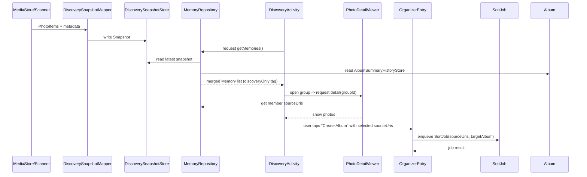

# Memory browsing first — 설계안

목표: "앱 안에서 위치 기반 기억을 먼저 보기"(Memory browsing first)를 기존 코드 구조에 최소 변경으로 반영하기 위한 설계 문서입니다. Personal Place UI는 아직 구현하지 않습니다. Gallery 정리 CTA는 유지하고 discovery-only 항목은 기존 Album history에 저장하지 않습니다.

## 핵심 원칙
- Memory browsing first: Memory view(DiscoverySnapshot/MemoryRecord)를 우선 노출
- Organize optional: 파일 이동은 사용자가 명시적으로 실행할 때만 수행
- Discovery-only: discovery에서만 보이는 그룹은 `discoveryOnly:true`로 표기, AlbumSummaryHistoryStore에 저장 금지
- 비파괴: 기존 `SortJob`/`SortWorker`/`SortInputStore` 흐름을 변경하지 않음
- MainActivity에 밀어넣지 말고 `DiscoveryActivity`/`DiscoveryFragment` + `DiscoveryViewModel`로 분리

## 저장 계약: `DiscoverySnapshotStore`
- 단위: Snapshot(immutable) per analysis run
- 식별자: `snapshotId`, `sourceSignature`, `createdAt`, `snapshotVersion`
- 주요 필드 (예시 JSON):

```json
{
  "snapshotId": "uuid",
  "snapshotVersion": "1",
  "sourceSignature": "media-index-v123",
  "createdAt": "2026-08-14T12:00:00Z",
  "photos": [
    {
      "photoRefId": "hash://sha1/sourceUri",
      "sourceUri": "content://media/...",
      "timestamp": 1620000000000,
      "lat": 37.5,
      "lng": 127.0,
      "mediaKind": "IMAGE",
      "noLocation": false
    }
  ],
  "groups": [
    {
      "groupId": "snapshot-v1--grid-37.5-127.0--day-2026-05-01",
      "memberPhotoRefIds": ["hash://..."],
      "centerLat": 37.5,
      "centerLng": 127.0,
      "radiusMeters": 80,
      "signature": "policyV1:hash(...)"
    }
  ],
  "noLocationSkipSet": ["hash://..."],
  "metadata": { "generatorPolicyVersion": "v1" }
}
```

- 구현 방안: 우선은 파일 기반 JSON 또는 Room table(버전 관리 컬럼 포함)로 저장. Append-only snapshot semantics 추천.

### Snapshot Store 복구·거부 정책

DiscoverySnapshotStore의 동작 원칙은 보수적 복구입니다. 읽기 시 메인 파일(`discovery_snapshot.json`)이 파싱 불가(corrupt)하면 우선 백업(`.bak`)을 시도해 복원하고, 실패한 메인 파일은 `.corrupt`로 보관합니다. 쓰기 전에는 메인 파일 상태를 검사해 메인이 손상되어 있고 백업이 없을 경우에는 덮어쓰기를 거부하여 기존 손상 데이터를 보존합니다. 이 정책은 UI에 아직 연결되기 전의 기반 저장소에 적합하며 "깨진 파일을 조용히 덮어쓰기"하는 위험을 차단합니다. 다만 장기적으로는 저장 실패·복구 이벤트를 진단 로그나 내부 상태로 기록하고, Mapper/Repository가 붙는 시점에 사용자에게 복구 안내 또는 자동 재시도(관리자 정책)를 제공하는 방안을 도입하는 것이 권장됩니다.

## 매핑 규칙: `DiscoverySnapshotMapper`
- 입력: `PhotoItem` 또는 `List<sourceUri>` + `snapshot metadata`
- 출력: `DiscoveryPhotoRef` (per-photo) + `DiscoveryMemoryGroup` (cluster)
- 안정성 규칙:
  - `photoRefId`는 `hash(sourceUri)`로 정의하여 안정적 참조 유지
  - groupId에 `snapshotVersion` + `mapperPolicyVersion` 포함 → 재현 가능성 보장
  - Mapper는 기존 `placeKey`/`locationKey`를 변경하지 않음. 오직 discovery-layer에서의 provisional grouping만 생성
- no-location 처리: `DiscoveryPhotoRef.noLocation=true`로 표시하고 snapshot-level `noLocationSkipSet`에 추가 가능

### 2026-08-14 Mapper MVP 경계

현재 코드 기준 `PhotoItem`에는 위도/경도 원본 좌표가 보존되어 있지 않다. 따라서 첫 `DiscoverySnapshotMapper` 구현은 GPS clustering을 수행하지 않고, 이미 분석된 `PhotoItem.locationKey`를 기준으로 discovery memory group을 만든다.

MVP 동작:

- `PhotoItem` -> Android 의존 없는 `SourceItem` -> `DiscoveryPhotoRef`
- `locationKey` 기준으로 `DiscoveryMemoryGroup` 생성
- `noLocation` 또는 `위치없음` 항목은 discovery memory group에서 제외
- `sourceUri`, 날짜, 국가/주소 metadata, 사진/동영상 구분을 보존
- `targetRelativePath`는 discovery-only memory에 섞지 않음

GPS 기반 반복 장소 후보 생성은 별도 `PlaceCandidate`/candidate generator 단계에서 다룬다.

## MemoryRepository 설계 (읽기 합침)
- 역할: `AlbumSummaryHistoryStore`(organized albums)과 `DiscoverySnapshotStore`(discovery groups)를 조합해 UI에 제공
- 공개 API 예시:
  - `getMemories(filter): List<MemoryItem>` — `MemoryItem`은 기존 MemoryRecord 또는 DiscoveryMemoryGroup을 추상화한 DTO
  - `getMemoryDetail(id)` — id가 discoveryGroupId면 snapshot에서 member list 반환
- Merge 정책:
  - Presentation: `MemoryRecord` 우선, discovery-only 그룹을 `discoveryOnly:true` 태그로 interleave
  - 저장: 절대 `DiscoveryMemoryGroup`을 `AlbumSummaryHistoryStore`에 넣지 말 것
  - Writes: Repository는 읽기 전용 패사드; Organizer 호출은 명시적 CTA로 외부에 위임

## discovery-only 상세 열기: `sourceUri` 기반
- 원칙: discovery-only detail은 파일 시스템 상대 경로(`relativePath`)가 아닌 `sourceUri`를 키로 연다
- Flow:
  - Detail 요청 -> `MemoryRepository.getMemoryDetail(groupId)` -> returns ordered `List<sourceUri>` 및 `photoRefId`
  - Photo viewer loads image/video by `sourceUri` via MediaStore / cached `PhotoItem`
  - CTA "Create album / Move to album" -> call existing Organizer entry point with selected `List<sourceUri>` (no automatic StoredAlbumSummary write)
- 실패 시: `sourceUri`가 없는 경우 placeholder 제공 및 사용자에게 복구 옵션 제공

## 분리 경계: Discovery vs Organizer
- Discovery UI: 완전 읽기 전용, discovery metadata와 candidate preview 노출
- Organizer: 기존 경로 유지. discovery에서 받은 `sourceUri` 리스트로 동작
- Contract: Discovery는 album 생성/정리에 대해 명령(CALL)만 함. 모든 이동/복사는 `SortJob` 경로를 통해 일괄 처리.

## No-location skip 배치
- 결정: snapshot 레벨에 `noLocationSkipSet`을 포함
- 이유: UI에서 "위치 정보 없음으로 건너뜀" 카운트/설정 표시 가능, 후보 생성 때 일관된 기준 제공

### No-location cache v2 안전 원칙

`noLocationSkipSet`은 메모리 후보/앨범 후보에서 제외하기 위한 discovery metadata이지, 다음 분석에서 해당 파일을 preview inventory에서 완전히 제거한다는 뜻이 아니다.

안전한 동작:

- MediaStore source inventory는 계속 확인한다.
- signature가 완전히 같은 no-location 파일만 비싼 `readLocation()` 경로를 생략한다.
- cache hit이어도 `PhotoItem(noLocation=true)`은 생성하여 `위치 없음 N개` 카운트가 유지되게 한다.
- Memory Browser group과 organizer 후보에서는 계속 제외한다.
- MediaStore latitude/longitude가 있으면 cache를 사용하지 않고 재분석한다.
- cache signature에는 source URI, mediaStoreId, displayName, date_modified, date_added, datetaken, media kind, size/duration, policyVersion을 포함한다.

이전 `NoLocationCache` v1은 새 사진/정리 대상이 0개로 잘못 보이는 회귀 위험 때문에 비활성 상태로 유지한다. v2는 별도 테스트와 리뷰 후 활성화한다.

## MainActivity에 넣지 말고 분리할 클래스
- UI: `DiscoveryActivity` (또는 `DiscoveryFragment`) + `DiscoveryViewModel`
- Coordinator: `DiscoveryCoordinator` 또는 `DiscoveryController` — `MemoryRepository`와 UI 사이 중재
- Navigation: Navigation graph에 discovery route 추가; MainActivity는 navigation host 역할만 수행

## 작은 패치 순서 (권장)
1. 문서화 및 인터페이스 정의 (DTOs, store contract) — 설계 문서 체크인
2. `DiscoverySnapshotStore` 인터페이스 + in-memory reference impl (unit test용)
3. `DiscoverySnapshotMapper` 순수 함수 구현 + 단위 테스트
4. `DiscoveryMemoryRepository` 읽기용 페이서드 구현(AlbumSummaryHistoryStore와 합침)
5. 임시 debug UI(Feature flag)로 discovery list + detail(by sourceUri) 노출
6. CTA 훅 연결: discovery -> Organizer entrypoint (no automatic writes)
7. 정책 조정, privacy 결정, 스토리지 변경(파일/Room) 논의

## 위험(Risks) 및 완화
- 사용자 혼란 (discovery group != Organizer placeKey)
  - 태그로 "provisional"/"discovery-only" 명시
- 재계산 비용(전체 스캔/Geocoder 재조회)
  - 기존 cached PhotoItem 재사용, snapshot 기반 증분 업데이트
- 실수로 저장소에 discovery 항목 쓰기
  - Repository에 쓰기 차단, 코드 리뷰/테스트

## 테스트 케이스 (요약)
- Mapper 유닛: 정해진 PhotoItem fixture -> expected DiscoveryPhotoRef + groupId
- Repository 통합: AlbumSummary + Snapshot 을 합쳤을 때 UI 리스트가 의도대로 표시되는지
- Detail by sourceUri: 존재/비존재 케이스
- CTA path: discovery -> Organizer 호출 시 전달되는 sourceUri 리스트 검증
- Privacy: snapshot export/backup 시 민감 좌표 필드 마스킹 테스트

## 시퀀스 다이어그램 (mermaid)


## 예시 JSON 스키마
- `DiscoveryPhotoRef` (요약)
```json
{
  "photoRefId": "string",
  "sourceUri": "string",
  "timestamp": "number",
  "lat": "number | null",
  "lng": "number | null",
  "mediaKind": "IMAGE|VIDEO",
  "noLocation": "boolean"
}
```

- `DiscoveryMemoryGroup` (요약)
```json
{
  "groupId": "string",
  "snapshotId": "string",
  "memberPhotoRefIds": ["string"],
  "centerLat": "number | null",
  "centerLng": "number | null",
  "radiusMeters": "number",
  "signature": "string"
}
```

- `DiscoverySnapshot` (요약, 앞의 예제와 동일)

## 다음 단계 제안
- 이 문서를 기반으로 small RFC PR 생성 후 팀 리뷰
- privacy/backup 정책(좌표 저장 여부) 결정
- snapshot storage 구현 방식(Room vs file) 결정

---
작성: 간단 설계 초안입니다. 더 상세한 스키마 예시나 sequence diagram 확대(예: candidate generator 내부 흐름)가 필요하면 알려줘요.
