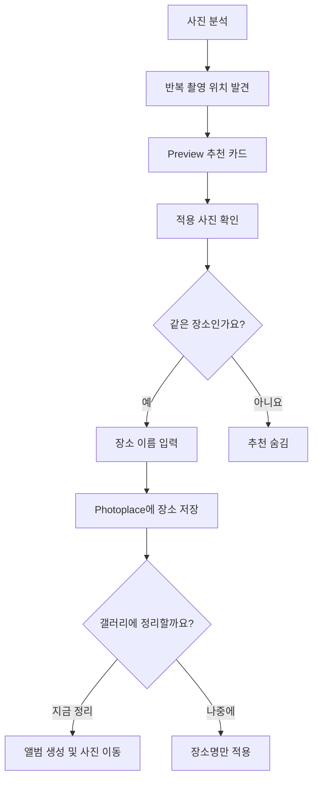

# Photoplace V2 PRD — 나만의 장소

- 문서 상태: Draft
- 작성일: 2026-07-25
- 대상 버전: V2
- 기능명(사용자 노출): 나만의 장소
- 내부 작업명: Personal Place

---

## 1. 배경

Photoplace의 기본 장소 분류는 행정구역과 확실한 대형 POI를 사용한다.

- 서울 및 광역시: 구 단위
- 일반 지역: 시·군 단위
- 확실한 대형 POI: 에버랜드, 롯데월드, 공항 등

이 방식은 자동 분류에는 안정적이지만, 사용자의 기억 단위와는 다를 수 있다.

예를 들어 `송파구`는 행정구역이지만 사용자는 같은 위치의 사진을 `라비에벨 발레`, `회사`, `엄마집`으로 기억한다. 사용자가 직접 기능을 찾아 규칙을 만드는 방식은 발견 가능성이 낮으므로, Photoplace가 반복 촬영 장소를 먼저 발견해 이름 지정을 제안한다.

---

## 2. 문제 정의

### 사용자 문제

1. 행정구역 단위 앨범은 범위가 넓어 개인적인 장소를 찾기 어렵다.
2. 사용자는 좌표, 주소, 반경을 이해하거나 직접 설정하고 싶어 하지 않는다.
3. 장소 이름 지정 기능을 메뉴 안에만 두면 기능의 존재를 알기 어렵다.
4. GPS가 가까운 사진이 반드시 같은 장소인 것은 아니므로 자동 분류 결과를 그대로 믿기 어렵다.
5. 앱 안의 장소명과 실제 갤러리 앨범이 분리되면 사용자가 결과를 체감하기 어렵다.

### 제품 기회

Photoplace가 반복된 촬영 위치를 발견하고 사용자가 개인적인 이름을 붙이게 하면, 행정구역 중심 분류를 기억 중심 탐색으로 전환할 수 있다.

---

## 3. 목표

### 핵심 목표

반복 촬영된 위치를 Photoplace가 먼저 제안하고, 사용자가 최소한의 입력으로 개인 장소를 만들며, 원할 경우 같은 이름의 실제 갤러리 앨범으로 안전하게 정리할 수 있게 한다.

### 제품 원칙

- 사용자는 규칙을 만드는 것이 아니라 장소에 이름을 붙인다.
- GPS, 좌표, 반경 같은 기술 용어를 기본 화면에 노출하지 않는다.
- 자동 판단보다 사용자의 확인을 우선한다.
- 장소 이름 지정과 실제 파일 이동을 분리한다.
- 사용자 지정 장소는 기본 행정구역 및 일반 POI보다 우선한다.
- AI나 클러스터링 기술을 전면에 내세우지 않는다.

---

## 4. 성공 기준

초기 출시 후 다음 지표를 관찰한다.

| 지표 | 정의 | 초기 목표 |
|---|---|---:|
| 추천 확인률 | 추천 카드에서 사진 확인 화면까지 진입한 비율 | 20% 이상 |
| 장소 저장률 | 추천 카드를 본 사용자 중 장소명을 저장한 비율 | 10% 이상 |
| 확인 후 저장률 | 사진 확인 화면 진입 후 장소를 저장한 비율 | 50% 이상 |
| 추천 거절률 | `같은 장소가 아니에요` 또는 숨김 비율 | 25% 이하 |
| 갤러리 정리 전환율 | 장소 저장 후 실제 앨범 정리를 실행한 비율 | 관찰 지표 |
| Undo 비율 | 앨범 이동 후 되돌리기를 실행한 비율 | 5% 이하 |

수치는 가설이며 베타 테스트 결과에 따라 조정한다.

---

## 5. 핵심 사용자 시나리오

> 사용자는 송파구에서 찍은 사진을 미리보다가 `여러 번 방문한 장소를 발견했어요`라는 추천 카드를 본다. 대표 사진을 확인하고 그 장소가 발레학원이라는 것을 알아본다. `라비에벨 발레`라고 이름을 붙이면 이후 해당 사진들은 Photoplace에서 이 이름으로 표시된다. 사용자가 원하면 같은 이름의 실제 갤러리 앨범을 만들고 사진을 이동한다.

---

## 6. 핵심 사용자 흐름

### 6.1 주 진입점 — 자동 추천

Preview 또는 Memory Dashboard 안에 추천 카드를 노출한다.

예시:

> **여러 번 방문한 장소를 발견했어요**  
> 2022년부터 186장  
> `[대표 사진 썸네일]`  
> 이 장소를 나만의 이름으로 기억할까요?  
> `[사진 확인]` `[나중에]`

원칙:

- 팝업으로 작업을 방해하지 않는다.
- 한 화면에서 최대 1~3개만 제안한다.
- 이미 이름을 붙인 장소와 확실한 POI는 추천하지 않는다.
- 숨긴 후보는 같은 조건으로 다시 제안하지 않는다.

### 6.2 사진 확인

저장 전에 후보 사진을 반드시 보여준다.

표시 정보:

- 대표 사진 그리드
- 전체 사진 수
- 촬영 기간
- 방문한 서로 다른 날짜 수
- 현재 기본 분류명(예: 송파구)

행동:

- `같은 장소예요`
- `같은 장소가 아니에요`
- 선택적으로 사진 개별 제외

MVP에서는 지도와 숫자 반경 조절을 제공하지 않는다.

### 6.3 이름 입력

화면 문구:

> **이 장소를 뭐라고 기억하세요?**

입력 예:

- 회사
- 엄마집
- 라비에벨 발레

요구사항:

- 사용자가 직접 이름을 입력한다.
- 기존 장소명 및 기존 갤러리 앨범명과 충돌하는 경우 저장 전에 알린다.
- 앞뒤 공백과 파일명에 사용할 수 없는 문자를 정리한다.
- 빈 이름은 저장할 수 없다.

### 6.4 장소 저장

저장 즉시 Photoplace 안에서 다음에 적용한다.

- 기존에 일치하는 사진
- 이후 새로 발견되는 일치 사진
- 장소 카드 및 검색 결과

저장 완료 문구:

> `라비에벨 발레`로 기억할게요.  
> 기존 사진과 앞으로 촬영한 사진에도 적용됩니다.

### 6.5 실제 갤러리 정리

장소 저장 직후 선택 행동으로 제공한다.

> 이 사진들을 `라비에벨 발레` 앨범으로 정리할까요?

- `지금 정리`
- `나중에`

`지금 정리` 선택 시:

1. 이동될 사진 수와 대상 앨범명을 보여준다.
2. 사용자 확인 후 앨범을 만들거나 기존 동일 앨범을 사용한다.
3. 사진을 이동한다.
4. 정리 기록을 남긴다.
5. Undo를 제공한다.

장소 이름 지정만으로 파일을 자동 이동해서는 안 된다.

---

## 7. 보조 진입점

자동 추천을 놓쳤거나 직접 수정하려는 사용자를 위해 다음 위치에도 `이 장소 이름 지정`을 제공한다.

- 장소 카드의 더보기 메뉴
- 사진 상세 화면
- 정리 결과 화면

보조 진입점에서도 저장 전 적용 사진을 보여주는 원칙은 동일하다.

---

## 8. 장소 후보 생성 정책

### 8.1 기본 조건

아래 값은 출시 확정값이 아니라 베타 테스트용 초기값이다.

- 위치 정보가 있는 사진만 대상
- 후보 내 최소 사진 수: 20장
- 서로 다른 촬영일: 최소 3일
- 반복 촬영 기간: 최소 2주 권장
- 좌표 밀집도: 초기 반경 100m 이내를 기본 가설로 사용
- 이미 개인 장소 또는 확실한 POI에 포함된 사진은 제외

사진 수보다 서로 다른 날짜의 반복 방문을 더 강한 신호로 사용한다.

### 8.2 후보 제외 또는 감점 조건

- 하루에만 대량 촬영된 여행지
- 좌표 정확도가 낮은 사진
- 이동 중 연속 촬영으로 보이는 사진
- 서로 다른 건물이나 도로 양쪽으로 넓게 퍼진 좌표
- 사용자가 이전에 거절한 후보
- 동일 사진 집합과 과도하게 겹치는 중복 후보

### 8.3 GPS 정확도의 한계

같은 건물 안의 카페, 식당, 학원처럼 수직 또는 근거리로 겹친 장소는 GPS만으로 구분할 수 없다. V2는 이를 자동으로 해결한다고 약속하지 않는다.

MVP의 의미:

> 가까운 위치에서 반복 촬영된 사진을 하나의 개인 장소 후보로 제안한다.

향후 사진 선택, 시간 패턴, Wi-Fi 또는 의미 분석 등을 보조 신호로 검토할 수 있으나 V2 MVP 범위에는 포함하지 않는다.

---

## 9. 장소명 결정 우선순위

사진 하나가 여러 규칙과 일치하면 다음 우선순위를 사용한다.

1. 사용자가 지정한 개인 장소
2. 확실한 대형 POI
3. 기본 행정구역

개인 장소가 지정된 사진은 실제 정리 시 기존 행정구역 앨범과 중복 이동하지 않는다.

예:

- 개인 장소 일치 사진 → `라비에벨 발레`
- 나머지 송파구 사진 → `송파구`

---

## 10. 이미 정리된 사진 처리

사진이 이미 `송파구` 앨범으로 이동된 뒤 개인 장소가 생성될 수 있다.

이 경우 자동으로 재이동하지 않고 다음과 같이 확인한다.

> 송파구 앨범의 사진 186장을  
> `라비에벨 발레` 앨범으로 옮길까요?

요구사항:

- 이동 전 사진 미리보기
- 대상 및 기존 앨범명 표시
- 정리 기록 저장
- Undo 지원
- 이동 후 빈 앨범 삭제 여부는 별도 정책으로 처리

---

## 11. 기능 요구사항

### P0 — V2 MVP

- 반복 촬영 위치 후보 생성
- Preview 추천 카드
- 후보 사진 미리보기
- 같은 장소 여부 확인
- 사용자 장소명 입력 및 저장
- 개인 장소 우선 적용
- 추천 숨김 및 재노출 방지
- 장소 저장과 갤러리 이동 분리
- 사용자 확인 후 실제 앨범 생성 및 사진 이동
- 정리 기록과 Undo 연동

### P1 — V2 후속

- 장소 카드 및 사진 상세에서 수동 이름 지정
- 후보 사진 개별 제외
- 잘못 포함된 사진 신고 또는 수정
- 개인 장소 수정·삭제
- 장소 이름 변경 시 갤러리 앨범명 변경 선택
- 이미 정리된 사진의 재이동
- 백업·복원 또는 기기 변경 대응

### P2 — 향후 검토

- `조금 좁게 / 조금 넓게` 방식의 범위 조정
- 지도 기반 영역 편집
- 복합건물 내 장소 구분
- 시간대·요일·사진 의미를 이용한 보조 분류
- 방문 기록과 재방문 회고
- 장소 메모

---

## 12. 비기능 요구사항

### 성능

- 대량 사진 분석은 WorkManager 기반 백그라운드 작업으로 수행한다.
- 추천 카드 표시를 위해 매번 전체 사진을 다시 스캔하지 않는다.
- 사진 추가·삭제 시 증분 갱신을 우선한다.

### 개인정보

- 가능하면 위치 군집화와 개인 장소 저장을 기기 내에서 처리한다.
- 외부 API 사용 시 전송되는 데이터와 목적을 명확히 정의한다.
- 사용자의 개인 장소명은 외부 공유를 기본값으로 하지 않는다.

### 신뢰 및 복구

- 실제 파일 이동 전 명시적 동의를 받는다.
- 이동 실패 시 부분 성공 상태와 실패 사진 수를 보여준다.
- 정리 기록에서 작업 결과를 확인할 수 있어야 한다.
- Undo는 원래 경로를 기준으로 복구한다.

---

## 13. 제안 데이터 구조

구현 언어와 현재 프로젝트 구조에 맞춰 조정하되, 책임은 분리한다.

### PersonalPlace

| 필드 | 설명 |
|---|---|
| id | 내부 고유 ID |
| displayName | 사용자 지정 장소명 |
| centerLat / centerLng | 대표 중심 좌표 |
| radiusMeters | 내부 판정 범위 |
| createdAt / updatedAt | 생성·수정 시각 |
| source | recommendation 또는 manual |
| status | active, hidden, deleted |

### PlaceCandidate

| 필드 | 설명 |
|---|---|
| id | 후보 ID |
| centerLat / centerLng | 후보 중심 |
| radiusMeters | 후보 계산 범위 |
| photoCount | 포함 사진 수 |
| distinctDateCount | 서로 다른 촬영일 수 |
| firstTakenAt / lastTakenAt | 촬영 기간 |
| score | 추천 우선순위 점수 |
| state | new, viewed, accepted, dismissed |

### PhotoPlaceMembership

| 필드 | 설명 |
|---|---|
| photoId 또는 mediaUri | 사진 식별자 |
| personalPlaceId | 연결된 개인 장소 |
| matchSource | auto 또는 manual |
| excludedByUser | 사용자가 제외했는지 여부 |

좌표와 반경만 저장하면 향후 알고리즘 변경 시 같은 사진 집합이 달라질 수 있다. 사용자가 확인한 기존 사진의 소속과 앞으로 들어올 사진에 적용할 공간 규칙을 분리해 저장하는 방안을 우선 검토한다.

---

## 14. 이벤트 및 분석 로그

- `place_candidate_impression`
- `place_candidate_open`
- `place_candidate_dismiss`
- `place_candidate_confirm`
- `personal_place_saved`
- `gallery_sort_prompt_shown`
- `gallery_sort_started`
- `gallery_sort_completed`
- `gallery_sort_failed`
- `gallery_sort_undo`

이벤트에는 개인 장소명 원문을 수집하지 않는다.

---

## 15. 수용 기준

1. 반복 방문 조건을 충족한 후보가 Preview에 카드로 노출된다.
2. 사용자는 저장 전 후보 사진, 사진 수, 촬영 기간을 확인할 수 있다.
3. 사용자가 후보를 거절하면 동일 후보가 다시 추천되지 않는다.
4. 이름 저장만으로 실제 파일이 이동되지 않는다.
5. 개인 장소가 저장되면 해당 사진의 표시 장소가 즉시 변경된다.
6. 새 사진이 개인 장소 조건과 일치하면 개인 장소가 기본 행정구역보다 우선한다.
7. 실제 앨범 정리는 별도의 사용자 확인 후 실행된다.
8. 이동 결과가 정리 기록에 남고 Undo가 가능하다.
9. 작업 일부가 실패하면 성공·실패 수량을 구분해 보여준다.
10. GPS만으로 구분할 수 없는 장소를 확정적으로 표현하지 않는다.

---

## 16. 제외 범위

V2 MVP에서는 다음을 구현하지 않는다.

- 모든 상점과 건물의 정확한 자동 POI 인식
- 사용자의 확인 없는 장소명 자동 생성
- 장소 저장과 동시에 자동 파일 이동
- 실내 층 또는 같은 건물 내 매장 구분
- 고급 지도 편집
- 클라우드 기반 개인 장소 동기화
- AI 기능의 별도 브랜딩 또는 노출

---

## 17. 구현 전 확인할 결정 사항

1. 현재 사진 식별자가 파일 이동 후에도 안정적으로 유지되는가?
2. 기존 정리 기록과 Undo가 재이동 시나리오까지 지원하는가?
3. 동일 이름의 기존 갤러리 앨범이 있을 때 합칠지 새 이름을 제안할지?
4. 후보 생성에 사용할 실제 위치 정확도 정보가 EXIF 또는 MediaStore에 충분한가?
5. 개인 장소 삭제 시 사진을 기본 행정구역으로 되돌려 표시할지?
6. 사용자가 확인한 기존 사진 집합과 미래 사진용 위치 규칙을 어떻게 분리 저장할지?

---

## 18. 권장 개발 순서

1. 후보 생성 알고리즘을 UI와 분리해 샘플 데이터로 검증
2. 기존 사용자 사진에서 후보 품질 측정
3. 추천 카드 및 후보 사진 확인 화면 구현
4. 개인 장소 저장과 장소명 우선순위 적용
5. 추천 거절 및 중복 방지 처리
6. 갤러리 앨범 생성·이동 연결
7. 정리 기록·Undo 연동
8. 베타 데이터로 임계값 조정

---

## 19. Gemini CLI 구현 전달용 요약

다음 범위만 먼저 구현한다.

> 반복된 GPS 밀집 후보를 생성하고 Preview에 추천 카드로 노출한다. 사용자가 후보 사진을 확인한 뒤 장소명을 입력하면 Photoplace 내부 장소로 저장한다. 장소명 우선순위는 사용자 지정 장소, 확실한 POI, 행정구역 순이다. 장소 저장만으로 파일을 이동하지 않으며, 갤러리 앨범 생성과 사진 이동은 별도 확인을 받은 뒤 기존 정리 기록 및 Undo 흐름을 사용한다.

구현 전에 현재 프로젝트의 장소명 결정 로직, 사진 식별 방식, 정리 기록, Undo, WorkManager 구조를 먼저 조사하고 변경 계획을 제시한다. 기존 클래스명이나 저장소 구조를 추측하여 새 클래스를 만들지 않는다.

